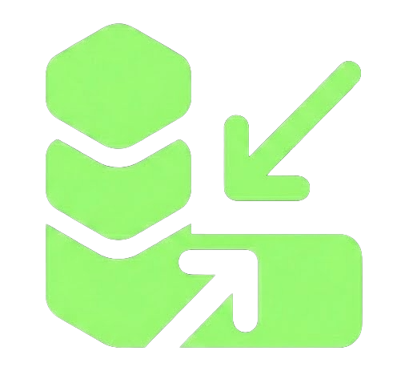

  
  <h1>Lakon</h1>
  
<b>Prompt compression for the era of long-context LLMs.</b>

> Stop sending your prompts raw. Compress tokens, preserve intent, and save 50-80% on API costs and latency.

---

## 🚀 The Product

Lakon is a browser extension that intelligently compresses your AI prompts before they reach Claude, ChatGPT, or Gemini. It doesn't just strip words—it restructures your signal to exploit how LLMs process attention (Primacy and Recency zones).

### **Before:** 
> "Hey, I hope you're doing well today. I was wondering if you could please help me understand the main differences between React and Vue, specifically focusing on how they handle state management and rendering performance, but keep it very simple for a beginner."

### **After (Lakon):**
> "Compare React vs Vue state management & rendering performance simply for beginner."

**Saved: 64% Tokens**

---

## 🛠️ Repository Structure

This repository contains the **Public Interface** of Lakon to build transparency and trust.

- `/extension`: The browser extension source code (injection logic, UI, and API interaction).
- `/web`: The official Lakon landing page and installation site.
- `/docs`: Visual guides and product documentation.

*Note: The backend compression engine and proprietary prompt-engineering logic are kept private to protect intellectual property while ensuring the client-side remains 100% auditable.*

---

## 🔒 Privacy & Trust

Lakon is built on a **Zero-Retention** philosophy.

- **No Prompt Storage**: We do not store the text you compress. Prompts are processed in real-time and passed directly to the model.
- **Transparent Processing**: Fast, stateless processing with zero data hoarding.
- **Local Control**: You can audit exactly how the extension interacts with your browser in the `/extension` folder.
- **No Tracking**: We don't track your identity or browsing history.

---

## 🎨 Features

- **One-Click Compression**: A subtle, native-feeling button appears next to the "Send" button in your favorite AI tools.
- **Multi-Platform**: Native support for **Claude.ai**, **ChatGPT**, and **Gemini**.
- **Instant Undo**: Instantly revert to your raw prompt if needed, ensuring complete control over your context.
- **Live Feedback**: Professional tooltips and toasts show exactly how many tokens you saved in real-time.

---

## 📥 Installation

### **For Users**
The easiest way to use Lakon is to download the pre-packaged extension from our [Official Site](https://lakonai.vercel.app).

### **For Developers (Manual Install)**
1. Clone this repository.
2. Go to `chrome://extensions` (or your browser's equivalent).
3. Enable **Developer mode**.
4. Click **Load unpacked** and select the `/extension` folder.
5. (Optional) Point the `API_BASE` in `content.js` to your own backend for custom processing.

---

## 🗺️ Roadmap

- [x] **v1.0**: Initial release for ChatGPT, Claude, and Gemini.
- [x] **v1.1**: Trust & Value Update (Undo architecture, professional UI toasts, layout stability).

---

## 📄 License

Distributed under the **MIT License**. See `LICENSE` for more information.

---

  Built with precision by <a href="https://github.com/Sumitagarwal-i">Sumit Agarwal</a>

